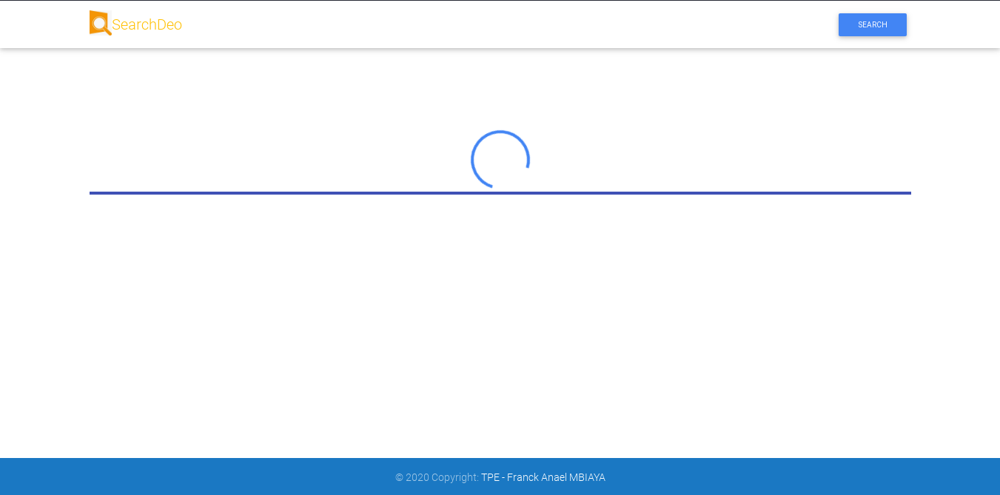
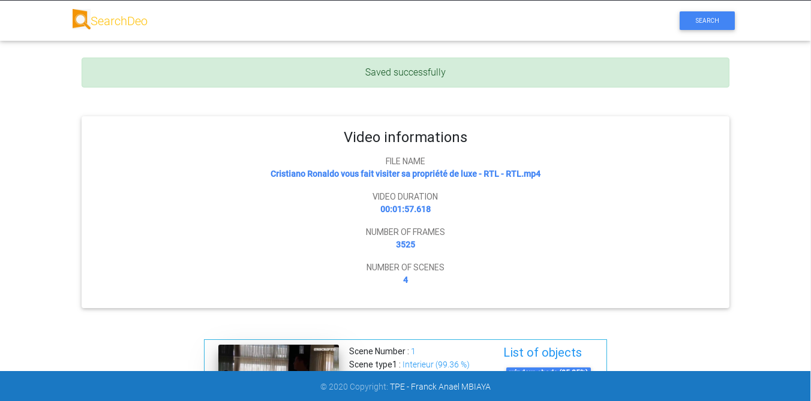
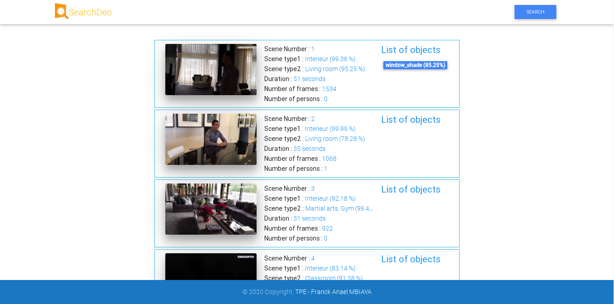
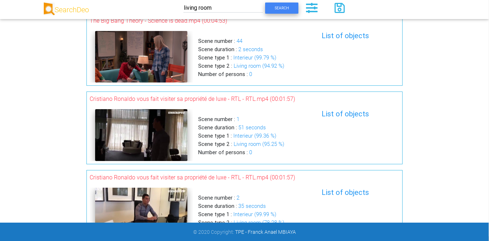
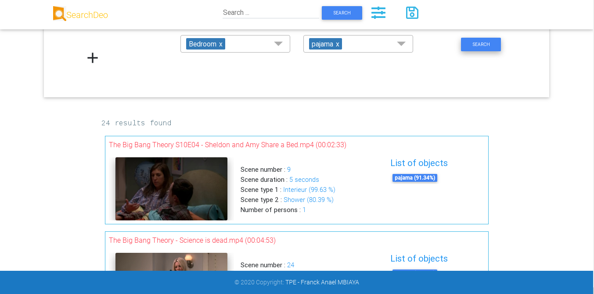
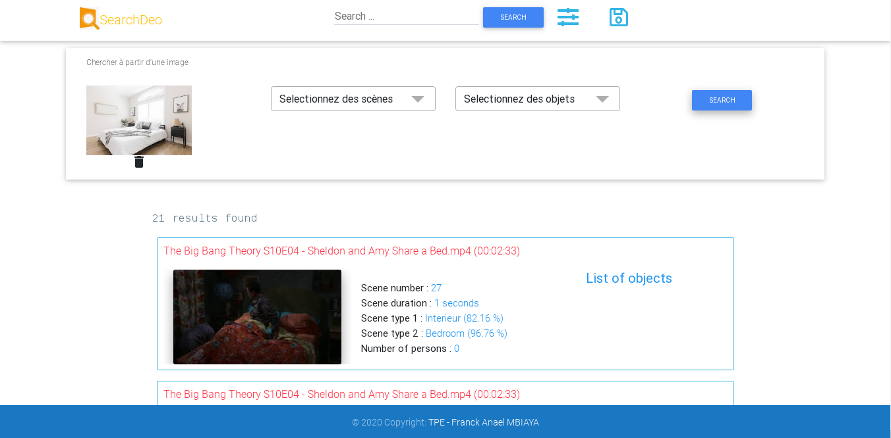

# TPE Video Research Frontend
Application frontend de recherche de vidéos et de scènes par le contenu. Le serveur avec lequel ce client communique est disponible via le lien https://github.com/Franelstar/TPE_Video_Research_Backend

# Langage
- TypeScript
- HTML
- CSS

# Librairie
Angular 10

# Captures

